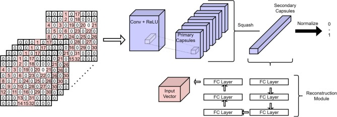
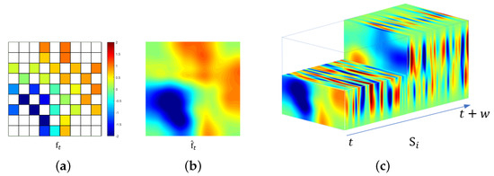
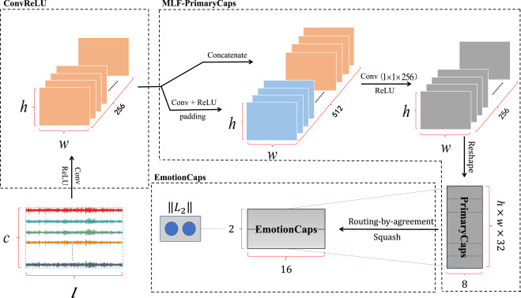
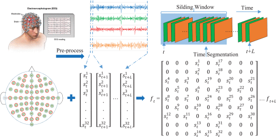

# 脑电情绪识别的参考

## 代码和论文参考

### Code: Enhanced-Capsule-Network-for-Emotion-Recognition   (tensorflow + CapsuleNet)
[Enhanced-Capsule-Network-for-Emotion-Recognition](https://github.com/HYQHUANGYUNQI/Enhanced-Capsule-Network-for-Emotion-Recognition/tree/main)

This is the project of my undergraduate thesis, an enhanced Capsule Network that integrates EEG and ECG signals for improved emotion recognition accuracy.

说是提升识别的准确率，使用了增强的CapsuleNet；
本科论文。没有说最终准确率，先忽略。

### Paper: Capsule neural networks on spatio-temporal EEG frames for cross-subject emotion recognition
[Capsule neural networks on spatio-temporal EEG frames for cross-subject emotion recognition](https://www.sciencedirect.com/science/article/pii/S1746809421009587#f0015)

2022年  Biomedical Signal Processing and Control  Q1  基于时空脑电图框架的胶囊神经网络跨主体情绪识别

参考这个文章的图片。

被试独立实验，也是用的2D 矩阵做的，然后进入胶囊网络。可以仔细看下这个怎么做的。

时空帧组（STF组）

预处理方式：因此，我们取基线信号的样本平均值，并 (B1+B2+B3)/3 从样本信号的剩余持续时间中减去 1 秒持续时间信号，以产生数据， 其形状为 [40 × 32 × 7680]。

然后，我们将 z 分数归一化应用于这样获得的数据，方法是减去受试者均值并除以受试者标准差，以获得信号的最终工作集。

CapsNets 更适合稀疏图像模式识别

CapsNets 更适合 3D 姿态推理

### Paper: Spatio-Temporal Representation of an Electoencephalogram for Emotion Recognition Using a Three-Dimensional Convolutional Neural Network

基于三维卷积神经网络的情绪识别脑电图的时空表征

2020年 

正确率99% 用的是3D卷积神经网络，可以参考下这个文章的方法。

我们验证了脑电图的有效表示和充分利用数据特征的网络可以胜过应用手工制作特征的方法。

因为之前的研究表明，1 秒的时间窗口适用于情绪识别 [ 42]

3D CNN 用于时空特征的提取

预处理一下脑电信号原信号 ： 1. 去掉avg(base)  2. 归一化  single-min(single)

### Paper: EEG Emotion Recognition Using Dynamical Graph Convolutional Neural Networks（引用上）
[Paper](https://www.sciencedirect.com/science/article/pii/S0010482520302663?via%3Dihub)
[Code](https://github.com/2018110060ding/EmotionCaps?tab=readme-ov-file) 

2020年   准确率 97.97%, 98.31% and 98.32%

tensorflow 框架实现

预处理方法的验证，验证了预处理的方法，基线去除能提升30%的准确率。  

`这个代码中有DEAP预处理的方法`

### Paper: Emotion Recognition from Multi-Channel EEG through Parallel Convolutional Recurrent Neural Network（引用上）
[Emotion Recognition from Multi-Channel EEG through Parallel Convolutional Recurrent Neural Network](https://ieeexplore.ieee.org/abstract/document/8489331)

2019年  `介绍了基线去除的方法`

为了提高识别准确性，我们使用预试验数据来测量基线信号与参与者接受刺激时记录的信号之间的差异。
首先，我们从所有 C 通道中取出预审信号(3s pre-trial signals)，并将其切成长度为 L 的 N 段。第一步之后，我们可以得到 N（C × L） 矩阵。其次，我们对所有这些矩阵进行元素相加并计算平均值。此步骤可以表述为：
这里 mati∈Rc)<ι 表示 ith 矩阵。经过这两个步骤，我们得到一个名为 C/×′L BaseMean的矩阵，用于在没有任何刺激的情况下表示受试者的基本情绪状态。第三，我们将原始脑电图信号分割成 M(C/×′L) 名为 RawEEG 的矩阵，然后减去每个矩阵的 BaseMean。我们用来表示实验信号和基线信号之间差异的数据被命名为 BaseRemoved，它的创建方式如下：

BaseMean=ΣN1matiN(1)

BaseRemovedj=RawEEGj−BaseMean

自己语言描述下：DEAP数据集，把3秒的基线信号做成 3个 32x128的矩阵，3个矩阵相加/3 得到BaseMean
再把每个60秒歌曲分为60个  32x128的BaseMean矩阵，每个矩阵减去BaseMean得到BaseRemoved。

### Code: Self-Routing Capsule Networks   2019  pytorch

[Self-Routing Capsule Networks](https://github.com/coder3000/SR-CapsNet?tab=readme-ov-file)

是2019年的SelfRouting CapsuleNetwork实现

### Code: External-Attention-tensorflow
[External-Attention-tensorflow](https://zhuanlan.zhihu.com/p/531793473)  : 各种注意力机制的tensorflow实现

### Code: YOLOv8改进实战专栏
[YOLOv8改进实战专栏](https://blog.csdn.net/weixin_43694096/article/details/130671688)  : 这个是视觉的改进专栏，介绍了很多图片识别的改进方法。
可以参考下。

